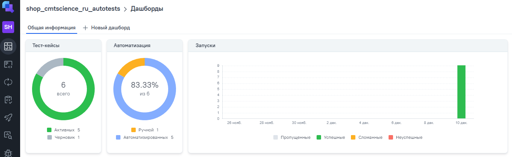
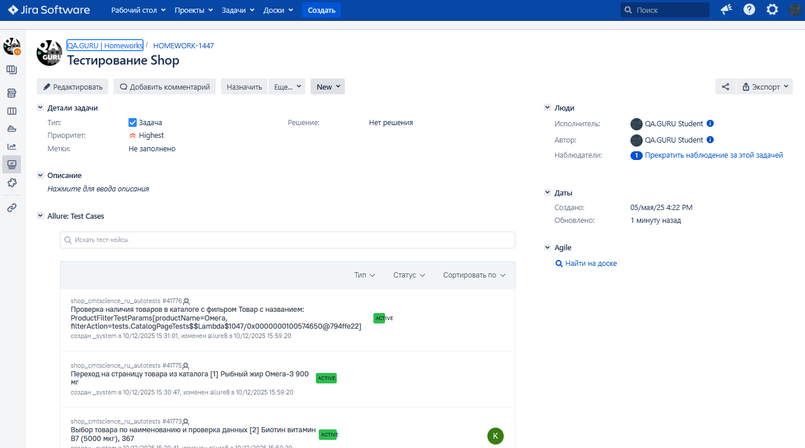

# Проект автоматизации тестирования интернет-магазина CMT Science

> Автоматизированное тестирование функционала [магазина спортивного питания](https://cmtscience.ru/catalog) CMT Science.
> Проект охватывает ключевые пользовательские сценарии, включая работу с каталогом, корзиной, фильтрами и поиском.

## **Содержание:**

---

*   <a href="#tools">Технологии и инструменты</a>
*   <a href="#pattern">Патерны проектирования автотестов</a>
*   <a href="#struct">Структура проекта</a>
*   <a href="#cases">Реализованные проверки</a>
*   <a href="#jenkins">Сборка в Jenkins</a>
*   <a href="#console">Запуск тестов</a>
*   <a href="#allure">Allure-отчет</a>
*   <a href="#allure-testops">Интеграция с Allure TestOps</a>
*   <a href="#jira">Интеграция с Jira</a>
*   <a href="#telegram">Уведомления в Telegram</a>

---

<a id="tools"></a>
## 🛠 **Технологии и инструменты:**

<p align="center">
  <a href="https://www.jetbrains.com/idea/"></a>
  <a href="https://www.java.com/"></a>
  <a href="https://github.com/"></a>
  <a href="https://gradle.org/"></a>
  <a href="https://junit.org/junit5/"></a>
  <a href="https://selenide.org/"></a>
  <a href="https://aerokube.com/selenoid/"></a>
  <a href="https://github.com/allure-framework/allure2"></a>
  <a href="https://qameta.io/"><</a>
  <a href="https://www.jenkins.io/"></a>
  <a href="https://www.atlassian.com/ru/software/jira/"></a>
  <a href="https://telegram.org/"></a>
</p>

<a id="pattern"></a>
## 🛠 **Патерны проектирования автотестов**
*В проекте используются паттерны **Page Object** и **Page Elements** для структурированности и чистоты кода.*

---

<a id="cases"></a>
## ✅ **Реализованные проверки:**

**Тестирование каталога (`/catalog`):**
*   ✓ Проверка отображения и корректности работы фильтров 
*   ✓ Проверка сортировки товаров (по цене, популярности, новизне)
*   ✓ Проверка работы поиска в рамках каталога
*   ✓ Проверка корректности отображения карточек товаров (наличие изображения, названия, цены, кнопки "В корзину")
*   ✓ Проверка перехода на страницу товара из каталога

**Тестирование корзины:**
*   ✓ Добавление товара в корзину из каталога
*   ✓ Добавление товара в корзину со страницы товара
*   ✓ Изменение количества товаров в корзине
*   ✓ Удаление товара из корзины
*   ✓ Проверка расчета итоговой стоимости

**Общие проверки:**
*   ✓ Проверка работы основного меню и навигации
*   ✓ Проверка работы поиска по всему сайту
*   ✓ Проверка оформления заказа (позитивный и негативные сценарии)

---

<a id="jenkins"></a>
##  **Сборка в Jenkins:**

<p align="center">
<a href="[Ссылка на вашу джобу в Jenkins]"></a>
</p>

### **Параметры сборки:**

| Параметр | Значение по умолчанию | Описание |
|----------|-----------------------|----------|
| `browser` | `chrome` | Браузер для запуска тестов |
| `browserVersion` | `100.0` | Версия браузера |
| `browserSize` | `1920x1080` | Разрешение окна браузера |
| `baseUrl` | `https://cmtscience.ru` | Адрес тестового окружения |
| `remoteUrl` | `[Ваш Selenoid]` | Адрес удаленного сервера (Selenoid) |

---

<a id="console"></a>
## 🚀 **Запуск тестов:**

### **Локальный запуск:**
```bash
gradle clean test -DbaseUrl="https://cmtscience.ru"
```

### **Удаленный запуск (с параметрами из Jenkins):**
```bash
gradle clean test
-Dbrowser=${browser}
-DbrowserVersion=${browserVersion}
-DbrowserSize=${browserSize}
-DbaseUrl=${baseUrl}
-DremoteUrl=${remoteUrl}
```

### Параметры сборки

* <code>BROWSER_NAME</code> – браузер, в котором будут выполняться тесты. По-умолчанию - <code>chrome</code>.
* <code>BROWSER_VERSION</code> – версия браузера, в которой будут выполняться тесты. По-умолчанию - <code>100.0</code>.
* <code>BROWSER_SIZE</code> – размер окна браузера, в котором будут выполняться тесты.
* <code>BASE_URL</code> – Url, по которому будет открываться тестируемое приложение. По-умолчанию - <code>1920x1080</code>.
* <code>REMOTE_BROWSER_URL</code> – адрес удаленного сервера, на котором будут запускаться тесты.

##  Сборка в Jenkins
<p align="center">

</p>

##  Пример Allure-отчета
### Overview

<p align="center">

</p>

### Результат выполнения теста

<p align="center">

</p>

##  Интеграция с Allure TestOps

Выполнена интеграция сборки <code>Jenkins</code> с <code>Allure TestOps</code>.
Результат выполнения автотестов отображается в <code>Allure TestOps</code>
На Dashboard в <code>Allure TestOps</code> отображена статистика пройденных тестов.

<p align="center">

</p>

##  Интеграция с Jira

Реализована интеграция <code>Allure TestOps</code> с <code>Jira</code>, в тикете отображается информация, какие тест-кейсы были написаны в рамках задачи и результат их прогона.

<p align="center">

</p>

##  Уведомления в Telegram с использованием бота

После завершения сборки, бот созданный в <code>Telegram</code>, автоматически обрабатывает и отправляет сообщение с результатом.

<p align="center">

</p>
